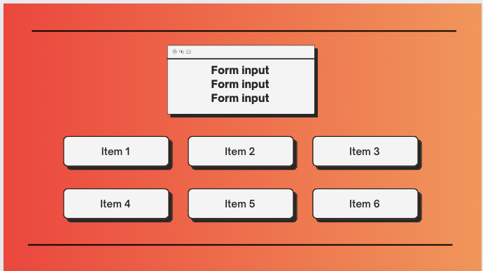
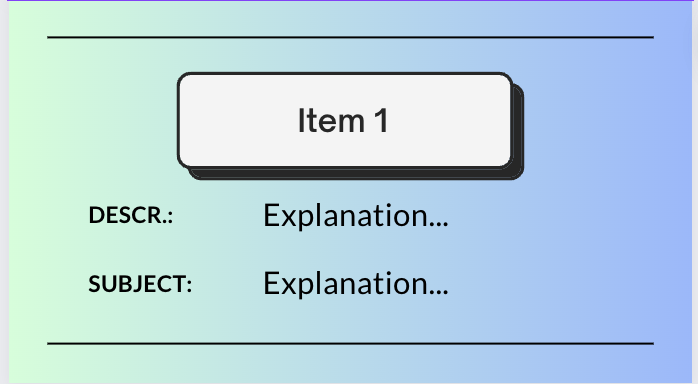

# portfolio-app

This webpage is a responsive Pokémon item search. Users will be able to search for specific in-game items that are fetched from PokeAPI.co

Users will see a list of items. Any items that are searched and submitted will be added to list of items.

## Setup

Users can enter any existing in-game Pokémon item into search. Item must be all lower-case and multi-word items must be hyphonated (e.g. poke-ball). Once user submits proper search, searched item will be added to list of items.

Users will be able to click any "Info" buttons on any of the items listed. Doing so will bring user to another page that will display more information on specific item.

Users can click on hyperlink below item description on backpage in order to return to main page.

## Wireframes

## User Stories

- As a user, I can see a landing page with a list of in-game Pokémon items.

- As a user, when I submit a proper form, a new item is added to the list.

- As a user, when I click "Info" below item, I am sent to another page with further details about selected item.
